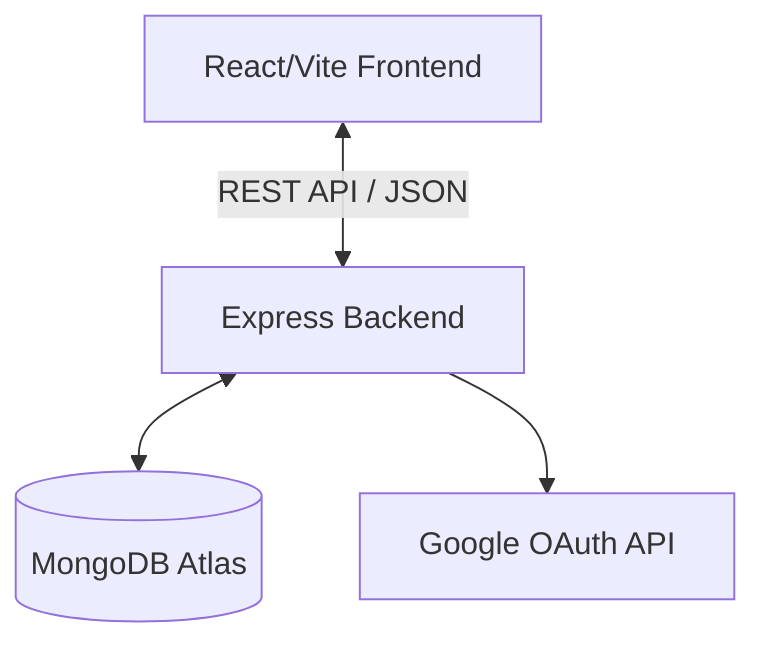

# Design Documentation - StockerAI Enterprise System

This document outlines the detailed system design, database architecture, frontend routing, and styling system for the StockerAI Enterprise Inventory Management System.

---

## 1. System Architecture

StockerAI is built using a modern decoupled client-server architecture:
- **Frontend Client**: React.js with Vite, TailwindCSS (v3), Lucide icons, and Recharts.
- **Backend API Server**: Node.js, Express, Passport.js authentication, and Mongoose (MongoDB ODM).

---

## 2. Database Schema Design

### 2.1 Users (`User.js`)
- `fullName`: String (Required)
- `email`: String (Required, Unique)
- `password`: String (Stored as Bcrypt hash, optional for OAuth users)
- `googleId`: String (Optional, for Google Sign-In)
- `role`: String (Default: `'Manager'`)

### 2.2 Inventory Items (`Product.js`)
- `name`: String (Required)
- `sku`: String (Required, Unique code)
- `description`: String
- `category`: String (Enum: `'Electronics'`, `'Clothing'`, `'Food'`, `'Hardware'`, `'Other'`)
- `price`:
  - `cost`: Number (Required)
  - `selling`: Number (Required)
- `stock`:
  - `current`: Number (Default: `0`)
  - `minimum`: Number (Default: `0`, triggers alert)
- `isActive`: Boolean (Default: `true`, for soft-deactivation)

### 2.3 Orders (`Order.js`)
- `orderNumber`: String (Required, Unique generated code)
- `orderType`: String (Enum: `'Purchase'`, `'Sales'`)
- `items`: Array of items containing product ID, quantity, and unit price.
- `totalAmount`: Number (Total price calculated)
- `status`: String (Enum: `'Pending'`, `'Completed'`)

---

## 3. Frontend Component & Navigation Design

- **State Management**: Zustand stores manage authentication sessions and user profiles.
- **Responsive Navigation**: 
  - On desktop, the sidebar displays inline navigation shortcuts.
  - On mobile, it transitions to a sliding overlay drawer with a backdrop blur overlay.
- **Visual Analytics**: Interactive Recharts widgets display monthly operations metrics and a stock health SVG progress ring.
